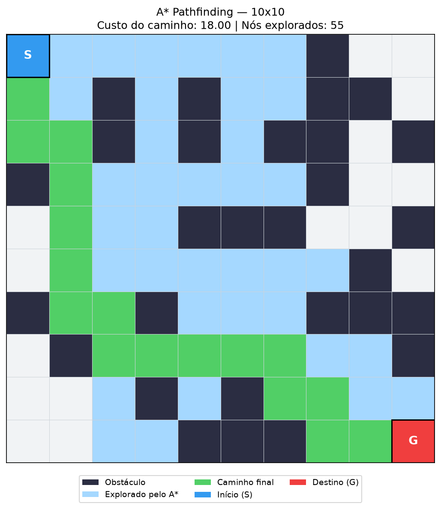
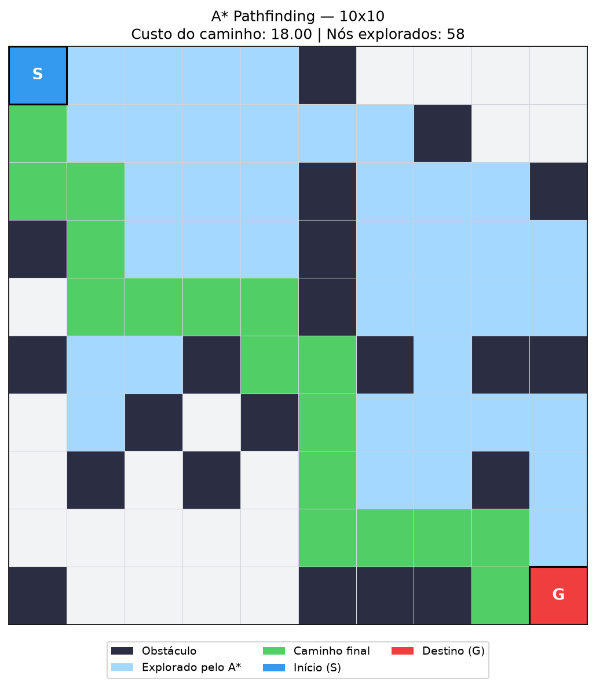
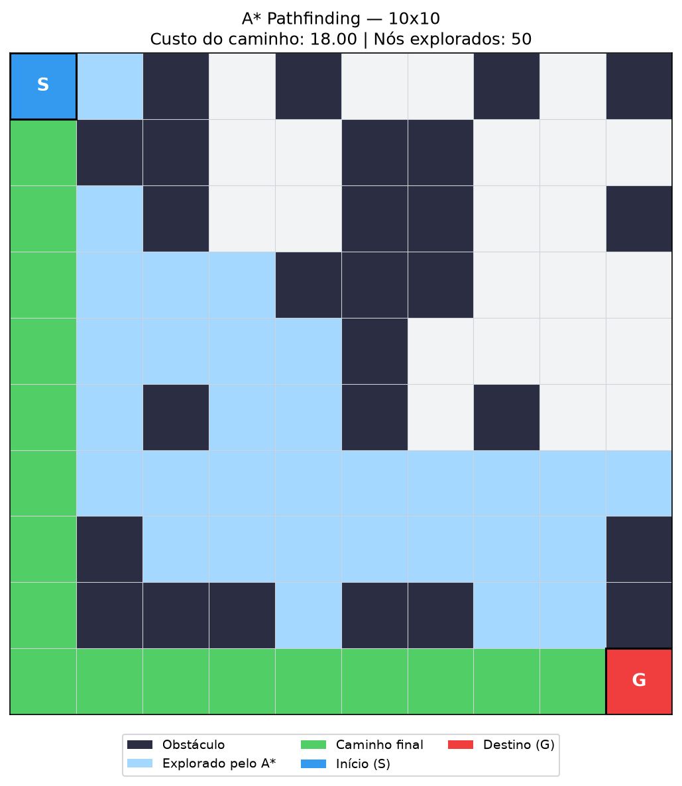

# Pathfinding A* em Grid

Número da Lista: 90<br>
Conteúdo da Disciplina: Grafos<br>
Grupo: 44
Link para vídeo no Youtube : https://youtu.be/cZiEbkVVOTs

## Alunos

|Matrícula | Aluno |
| -- | -- |
| 232002664  |  Giovanni Dornelas Ferreira |
| 231011097  |  André Ricardo Meyer de Melo |

## Sobre

Este projeto aplica o algoritmo **A\*** em um grid 2D com obstáculos
para encontrar o caminho de menor custo entre um ponto de partida (**S**) e
um destino (**G**).

O grid é modelado como um **grafo**: cada célula livre é um vértice, e as
arestas conectam células vizinhas (movimento em 4 direções: cima, baixo,
esquerda e direita), com custo 1 por passo.

O A* combina o custo acumulado `g(n)` com uma heurística admissível `h(n)`
(distância de Manhattan), expandindo sempre o nó de menor
`f(n) = g(n) + h(n)`. Assim, a busca é “puxada” na direção do objetivo,
explorando menos células do que uma busca uniforme (Dijkstra).

A cada execução, um labirinto aleatório (~25% de obstáculos) é gerado.
O programa imprime no terminal o custo do caminho e a quantidade de nós
explorados, e salva uma imagem colorida do resultado.

**Legenda da visualização:**

| Cor | Significado |
| -- | -- |
| Azul | Início (S) |
| Vermelho | Destino (G) |
| Verde | Caminho final |
| Azul claro | Células exploradas pelo A* |
| Cinza escuro | Obstáculos |
| Branco | Células não exploradas |

## Screenshots







## Instalação

Linguagem: Python 3<br>
Framework: matplotlib (apenas para a visualização)<br>

Pré-requisitos: Python 3 instalado.

```bash
pip install -r requirements.txt
```

## Uso

Na pasta do projeto, execute:

```bash
python3 main.py
```

O programa:
1. Gera um labirinto aleatório 10×10
2. Roda o A* de `(0,0)` até `(9,9)`
3. Mostra no terminal se encontrou caminho, o custo e os nós explorados
4. Salva a imagem em `astar_result.png`

Abra `astar_result.png` para ver o visual. Cada execução gera um labirinto diferente.

## Outros

Arquivos do projeto:

| Arquivo | Descrição |
| -- | -- |
| `grid.py` | Representação do grid e gerador aleatório de obstáculos |
| `astar.py` | Implementação do A* (heurísticas Manhattan e Euclidiana) |
| `visualize.py` | Desenho do grid, caminho e nós explorados |
| `main.py` | Execução principal |
| `requirements.txt` | Dependências do projeto |

Complexidade: O(E log V) com fila de prioridade (heap), igual ao Dijkstra;
a heurística melhora o desempenho prático ao reduzir nós expandidos.
